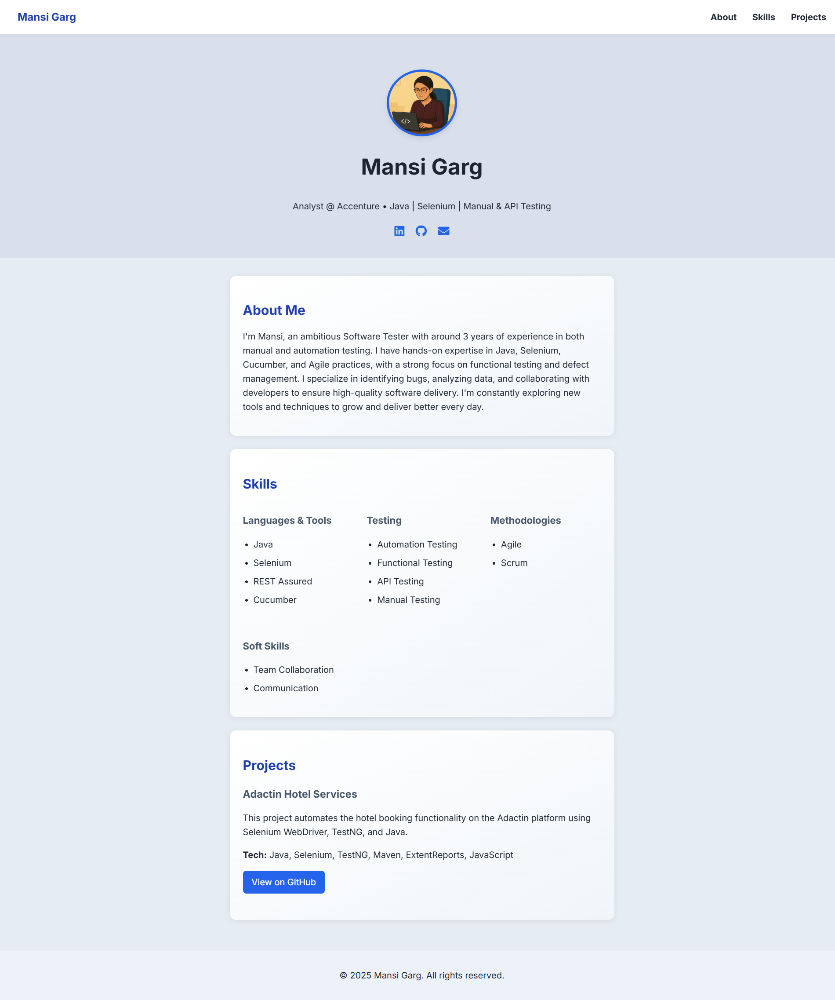

# 💼 Mansi Garg | Portfolio Website

Welcome to the source code of my personal portfolio website, a responsive, minimalist showcase of my skills, experience, and projects in software testing and automation.

---

## 🧑‍💻 About Me

Hi! I'm **Mansi Garg**, currently working as an **Analyst at Accenture** with a passion for ensuring software quality. I have 3 years of experience in:

- Java-based Automation Testing
- Selenium, Cucumber, REST Assured
- Manual & API Testing
- Agile, Scrum methodologies

This portfolio reflects both my professional background and my aesthetic preferences as a QA Engineer.

---

## 🛠️ Built With

- **HTML5**, **CSS3**, **JavaScript**
- **Inter font** from Google Fonts
- **FontAwesome** for icons
- **particles.js** for animated background
- **Responsive Grid Layout**

---

## 🚀 Features

- Clean and responsive design
- Skills categorized in a grid layout
- Projects with tech stack and GitHub links
- Smooth scroll navigation
- Background animation using particles.js
- Accessible and semantic HTML

---

## 🔗 Live Demo

> You can view the live site [here](https://mansigarg10.github.io/)

---

## 📬 Contact

📧 [mansigarg2787@gmail.com](mailto:mansigarg2787@gmail.com)

---

_Thanks for visiting!_ 🌟
